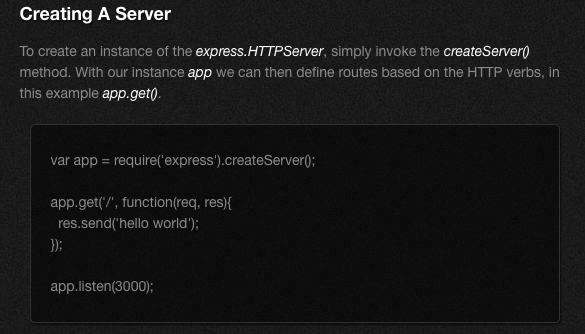

# Express-Servers
* [Express](http://expressjs.com/2x/guide.html) High performance, high class web development for Node.js

* [EJS](http://ejs.co/) Embedded JavaScript, <%=...%>, enables dynamic templates.
* Instead of using [res.send()](https://expressjs.com/en/guide/routing.html), GET and the POST methods to the root of the app.
* Use [res.render()](https://codeforgeek.com/2015/01/render-html-file-expressjs/) to render HTML(from an EJS) file.
* [Static Files](https://www.tutorialspoint.com/expressjs/expressjs_static_files.htm) Express, by default does not allow you to serve static files. You need to enable it using middleware.

# Install
* npm init creates package.json
* npm install express --save
* npm install ejs --save

# Acknowledgements
* Udemy
* Duy Do

# Author

*Sonia Bradley

